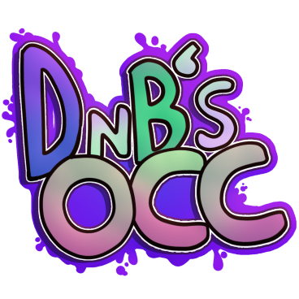

# Dave And Bambi's Occurrence

dave and bambers

we using a modded version of psych engine ig
and it is better (real)

# how to compile

you need:
- flixel
- flixel-addons
- flixel-ui
- discord_rpc (`haxelib git discord_rpc https://github.com/Aidan63/linc_discord-rpc`)

once you got these from the haxelibs... uh you do the thingy mah agmodnoam aw otgjmeoijtmaoirmariook4j3wiu8598q37654r9qiuasdnijawhsnriunhailhdskjshakjgndkjfhdkjgnkfdg

lime teaesting platforming

# if you want to improveing up the engine

if you want to make the engine better read the CONTRIBUTING.md

# stuffs about engine

- is chad ✅
- has more options ✅
- custom menu sound effects ✅
- custom character select ✅
- bambi ✅
- achievements ✅
- secret songs ✅
- alerted of updates ✅
- among us popit ✅
- triangles ✅
- fast and lightweight ✅
- crash handler ✅
- 50 dollar bamber ✅
- epicaliacling eningene ✅
- weak code ❌  
- bad people ❌
- really spamming songsyys ❌

# info

[play now](https://gamebanana.com/mods/418623)

this is running on occurrence engine which is modded [psych engine 0.5.1 git](https://github.com/ShadowMario/FNF-PsychEngine/commit/20ee49137e40eb0d7d06263cb1147ee749832e5d) with some pieces of psych engine 0.6.2 (conductor and musicbeatstate)
